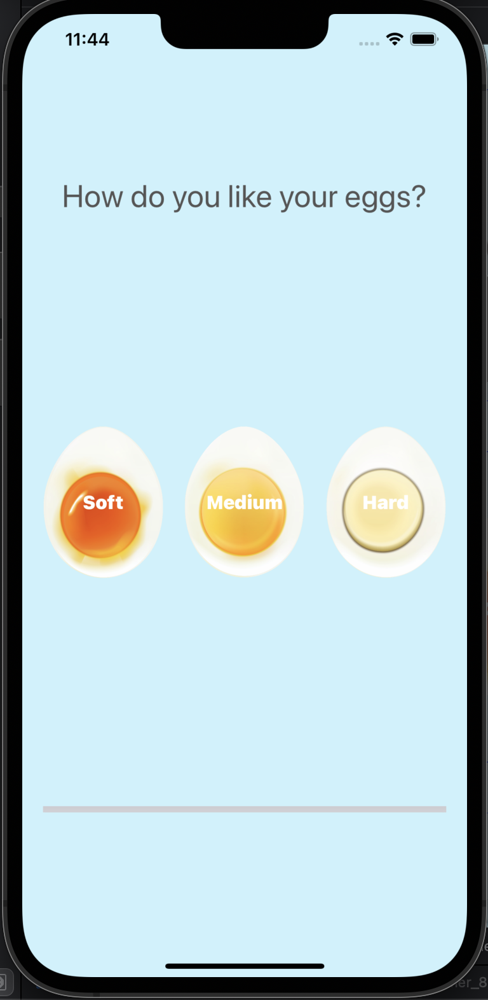

## What We Made

We  built a beautiful egg timer app to boil our eggs to perfection depending on how we prefer eggs.

## What we used

* Swift Collection types - Dictionaries
* The Swift Timer API
* Conditional statements - IF/ELSE
* Conditional statements - Switch
* Functions with outputs
* Used the ProgressView
